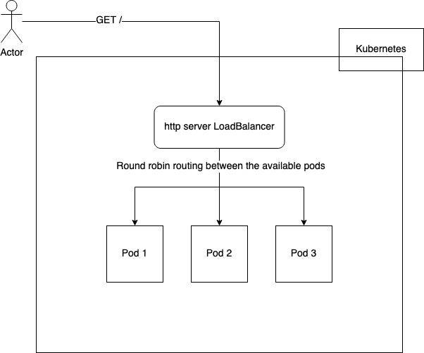

# http_server
A dead simple Ruby web server.
Serves on port 80.
/healthcheck path returns "OK"
All other paths return "Well, hello there!"

`$ ruby webserver.rb`

# Kubernetes Setup

To run this example, one would require `minikube`

macOS instructions -
`brew install minikube`

For Linux installation instructions - https://minikube.sigs.k8s.io/docs/start

# Build & Deployment Instructions

1. Navigate to `deployment` directory
2. Run `bash setup-minikube.sh` (This will start a minikube instance if one isn't already running)
3. Tobuild the docker image run `bash build-docker.sh n.n.n` (Where n.n.n is the semver you would like the associate with the built docker image)
4. To deploy run `bash deploy-app.sh n.n.n` (Where n.n.n is the semver which was previosly used in step 3) 

Deployment manifests are located under `deployment/k8s`
# Accessing application from minikube

As macOS doesn't allow direct access to the LoadBalance (due to the limitation of running a Linux VM), the following command would need to be run to expose the service
`kubectl --context minikube port-forward svc/http-server-svc 8080:80`

Now a command such as `curl localhost:8080` can be run

On Linux one can run `kubectl --context minikube get svc http-server-svc` and use the IP address associated with External IP field to directly access the LoadBalancer

# Application Architecture

